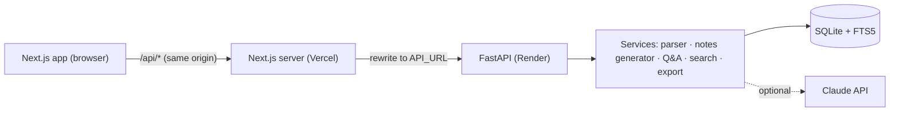
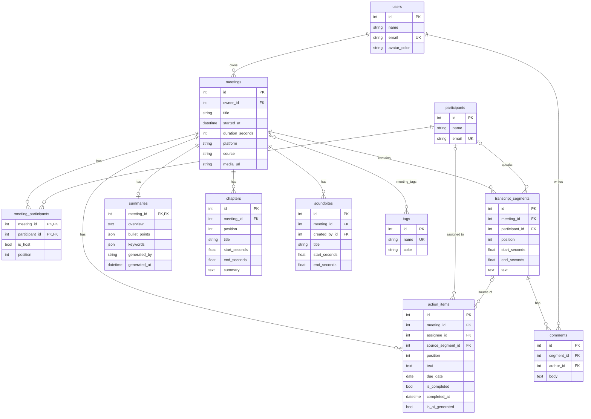

# Fireflies.ai Clone: Meeting Notes & Transcription Platform

A full-stack clone of the Fireflies.ai meeting workspace. Browse a library of meetings, read interactive transcripts that stay in sync with a media player, review AI summaries, outlines and action items, search across every transcript, and manage meetings end to end.

**Live demo:** _coming soon, deployment in progress_

## Features

**Meetings library**
- Meetings grouped by date (Today, Yesterday, This week…) with title, date, duration, platform, participants, tags and open action item count
- Filter by title or participant name, participant, tag and date range; sort by recency, age, length or title
- Filters live in the URL, so they survive reloads and can be shared
- Separate Uploads view for meetings created from files or pasted transcripts

**Meeting detail**
- Interactive transcript with speaker avatars, labels and timestamps
- Media player with play/pause, ±15s skip, playback speed, a seek bar showing speaker-coloured segments and chapter markers
- Two-way sync: clicking a transcript line (or any timestamp) seeks the player, and the playing line is highlighted and auto-scrolled
- Transcript search with highlighted matches, "n of m" counter, Enter / Shift+Enter navigation, speaker filter chips
- Summary tab: keywords, overview, shorthand notes, clickable outline (chapters) and action items
- Action items tab: add, edit inline, assign, set due dates, complete, delete, jump to the moment it was said
- Ask AI tab: ask questions about the meeting and get answers with clickable citations
- Speakers tab: talk-time share per participant
- Soundbites: clip a moment from the playhead or from any transcript line
- Comments on individual transcript lines
- Export to Markdown, plain text or PDF (print view)
- Edit metadata (title, date, platform, participants, tags), regenerate AI notes, delete

**Workspace**
- Create meetings by uploading `.txt`, `.vtt`, `.srt` or `.json` transcripts (drag & drop), pasting a transcript, or a manual form
- Global search across meeting titles, participants and full transcript text (SQLite FTS5), jumping straight to the matching moment
- Action Items page aggregating tasks from every meeting
- Toast notifications, confirmation modals, loading skeletons, empty and error states
- Dark mode
- Settings page and "Coming soon" placeholders for the live notetaker bot, integrations, analytics and team sharing

## Tech stack

- **Frontend:** Next.js 16 (App Router, TypeScript), Tailwind CSS 4, SWR, Radix UI primitives, lucide-react icons, sonner toasts, next-themes
- **Backend:** Python 3.12, FastAPI, SQLAlchemy 2, Pydantic 2, uv
- **Database:** SQLite with an FTS5 full-text index
- **AI (optional):** Anthropic Claude via the official `anthropic` SDK with structured outputs. Without an API key a built-in extractive summarizer is used.
- **Testing:** pytest, Vitest + React Testing Library, Playwright

## Architecture



- The frontend calls a relative `/api/*` path. `next.config.ts` rewrites it to the backend (`API_URL`), so the browser never makes cross-origin requests and no CORS setup is needed in production.
- **Backend layers**
  - `routers/`: thin HTTP handlers (validation, status codes, ownership checks)
  - `services/`: business logic
    - `transcript_parser.py`: detects and parses TXT, WebVTT, SRT and JSON, normalises timing and merges consecutive lines
    - `notes_generator.py`: summary, bullets, keywords, chapters and action items (Claude or heuristic)
    - `meetings.py`: create, update and serialize meetings; apply generated notes
    - `qa.py`: Ask AI, using Claude or TF-IDF retrieval over transcript lines
    - `search.py`: FTS5 query with ranked snippets
    - `export.py`: Markdown and text export
  - `models.py` / `schemas.py`: SQLAlchemy ORM models and Pydantic API contracts
  - `seed/`: eight hand-written sample meetings loaded on first start
- **Frontend layers**
  - `lib/`: typed API client, SWR query hooks, pure transcript and format utilities, and the player controller (split into a state context and a stable controls context so transcript lines don't re-render on every frame)
  - `components/ui`: reusable primitives (Button, Modal, Field, Avatar, TagChip, states)
  - `components/meetings`: library, filters, create/edit/delete, tasks and search
  - `components/meeting`: detail page (header, transcript, player, notes, action items, Ask AI, speakers, soundbites)
- **Media playback:** the assignment treats audio as out of scope, so the player drives a simulated clock over the transcript timeline. If a meeting has a `media_url`, the same controller drives a real `<audio>` element instead.

## Database schema



**Design notes**
- **Participants are a shared directory**, linked to meetings through `meeting_participants`, which carries per-meeting data (`is_host`, display order). The same person can be filtered on across meetings, and speakers are matched to that same table.
- **Transcripts are one row per utterance.** Each row has a speaker foreign key and start/end times, with a unique `(meeting_id, position)` and a check that `end_seconds >= start_seconds`. An index on `(meeting_id, start_seconds)` supports time lookups.
- **Summary is 1:1 with a meeting**, keyed by `meeting_id`. `bullet_points` and `keywords` are small ordered lists that are always read and written together, so they're stored as JSON instead of child tables. `generated_by` records whether notes came from the seed, the heuristic or a specific Claude model.
- **Action items** point at their assignee and at the transcript segment where they were agreed, which powers "jump to moment". `is_ai_generated` lets "Regenerate AI notes" replace machine-made items while keeping ones the user added by hand.
- **Deletes and cascades**
  - Deleting a meeting cascades to everything it owns.
  - Deleting a participant or segment sets referencing foreign keys to `NULL` instead of deleting tasks.
  - `PRAGMA foreign_keys=ON` is set on every connection so SQLite enforces all of this.
- **Full-text search** uses an FTS5 external-content table (`transcript_segments_fts`) kept in sync by insert, update and delete triggers, with Porter stemming and BM25 ranking.

## API overview

All routes are prefixed with `/api`. Interactive docs are at `/docs` on the backend.

**Workspace**
- `GET /me`: current (mock) user and whether an LLM is configured
- `GET /participants`, `GET /tags`, `POST /tags`
- `GET /search?q=`: matching meetings plus ranked transcript snippets

**Meetings**
- `GET /meetings`: list with filters `q`, `participant_id[]`, `tag_id[]`, `source[]`, `date_from`, `date_to`, `sort` (`recent|oldest|longest|shortest|title`), `page`, `page_size`
- `POST /meetings`: create from JSON (optional `transcript` text with `transcript_format`)
- `POST /meetings/upload`: multipart upload of a transcript file (`file`, optional `title`, `started_at`, `platform`, `participants`, `tag_ids`)
- `GET /meetings/{id}`: detail with participants (talk time), tags, summary, chapters, action items, soundbites
- `GET /meetings/{id}/transcript`: transcript segments with speaker names and comment counts
- `PATCH /meetings/{id}`: update title, date, platform, participants, tags
- `DELETE /meetings/{id}`
- `POST /meetings/{id}/regenerate`: regenerate AI notes (keeps manual action items)
- `POST /meetings/{id}/ask`: `{ question }` → `{ answer, citations[], generated_by }`
- `GET /meetings/{id}/export?format=md|txt`

**Action items**
- `GET /action-items?completed=&assignee_id=`: across all meetings
- `GET|POST /meetings/{id}/action-items`
- `PATCH|DELETE /action-items/{id}`

**Comments & soundbites**
- `GET /meetings/{id}/comments`, `POST /segments/{id}/comments`, `DELETE /comments/{id}`
- `POST /meetings/{id}/soundbites`, `DELETE /soundbites/{id}`

## Running locally

Prerequisites: Node.js 20.9+, Python 3.12+ and [uv](https://docs.astral.sh/uv/).

```bash
# Backend (http://localhost:8000, docs at /docs)
cd backend
uv sync
uv run uvicorn app.main:app --reload --port 8000

# Frontend (http://localhost:3000)
cd frontend
npm install
cp .env.example .env.local   # API_URL=http://localhost:8000
npm run dev
```

The database is created and seeded automatically on first start. To reset it:

```bash
cd backend && uv run python -m app.seed --reset
```

To enable Claude-generated notes and answers, set `ANTHROPIC_API_KEY` before starting the backend (optionally `ANTHROPIC_MODEL`, default `claude-opus-5`). Any LLM error falls back to the heuristic generator.

**Backend environment variables**
- `DATABASE_URL`: default `sqlite:///backend/fireflies.db`
- `SEED_ON_STARTUP`: seed when the database is empty (default `true`)
- `SEED_TIMEZONE`: timezone used for sample meeting times (default `Asia/Kolkata`)
- `CORS_ORIGINS`: comma separated, default `*` (only needed if the API is called cross-origin)
- `ANTHROPIC_API_KEY`, `ANTHROPIC_MODEL`

**Frontend environment variables**
- `API_URL`: origin of the FastAPI backend that `/api/*` is proxied to

## Testing

```bash
./scripts/test-all.sh          # everything below
SKIP_E2E=1 ./scripts/test-all.sh
```

- **Backend (pytest):** transcript parsing for every format, meeting CRUD, filters and sorting, uploads, action item lifecycle, regeneration, comments, soundbites, search, Ask AI, export and seed integrity
- **Frontend unit and component tests (Vitest + Testing Library):** formatting, transcript matching, the API client, the player clock, the transcript panel (search, seek, speaker filter, comments, soundbites), media player, notes, action items, Ask AI, the create modal (paste, upload, manual, validation), library filters, edit and delete, tasks and search
- **End to end (Playwright):** starts the real backend on a throwaway database plus the Next.js dev server, then exercises the full user flows in Chromium

## Deployment

- **Backend on Render:** `render.yaml` defines a Python web service rooted at `backend/` with a persistent disk mounted at `/var/data` for the SQLite file. Set `ANTHROPIC_API_KEY` in the dashboard if you want Claude notes.
- **Frontend on Vercel:** import the repo with **Root Directory** `frontend` and set `API_URL` to the Render service URL.

## Assumptions

- **Single user:** authentication is mocked and a default user always owns every meeting. Endpoints still scope data by owner, so real auth can be added without schema changes.
- **No speech-to-text:** meetings come from seeded data, uploaded or pasted transcripts, or a manual form. Audio isn't stored, so the player simulates playback against transcript timestamps.
- **Transcript input:** speaker names are taken from the transcript. Unknown speakers become participants automatically. When a transcript has no timestamps, timing is estimated at about 2.5 words per second.
- **Notes without an LLM:** the fallback is heuristic. Keywords come from n-gram frequency, notes from sentence salience, action items from commitment phrases ("I'll…", "can you…", deadlines) and chapters from time-sliced TF-IDF topics.
- **Placeholders:** the live meeting bot, integrations, analytics and team sharing are "Coming soon".
- **Timestamps:** stored in UTC and rendered in the viewer's local timezone.
